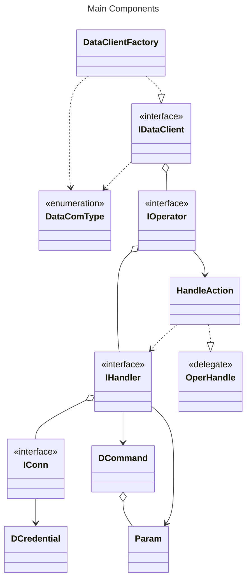
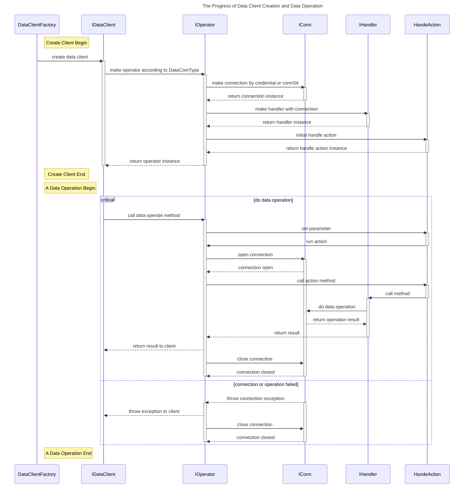
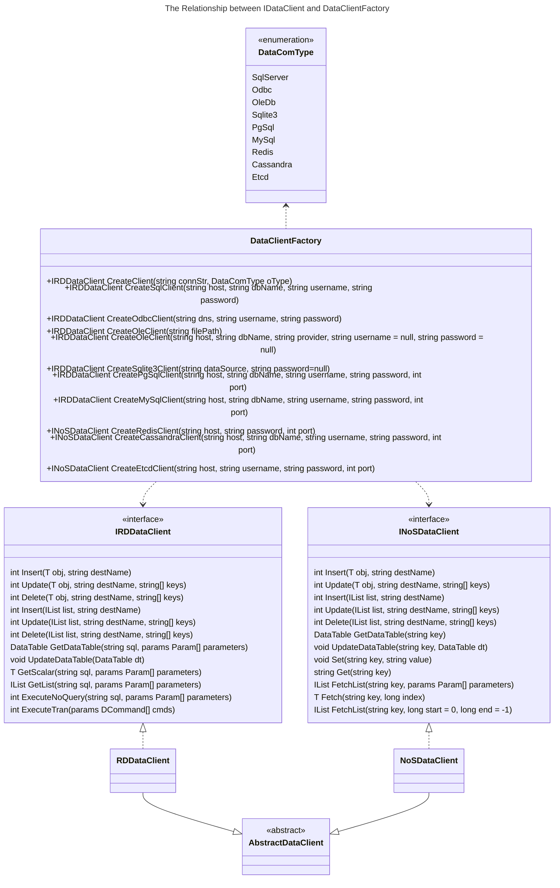

<h1 align="center">
  DataCom
  <br>
</h1>

<h4 align="center">
A database client library written in C# support not only relationship database include Sqlserver, Odbc, Oledb, Mysql, PostgreSql and Sqlite, but also no relationship database such as redis, cassandra or etcd.
</h4>

<p align="center">
  <a href="#key-features">Key Features</a> •
  <a href="#architecture">Architecture</a> •
  <a href="#install-library-from-Nuget">Install library from Nuget</a> •
  <a href="#credits">Credits</a> •
  <a href="#authors">Authors</a> •
  <a href="#license">License</a>
</p>

## Key Features

* Factory Pattern - Encapsulation, Flexibility, Code Reusability, Cacheable, Testability
  - It is one of the most used design patterns, which provides one of the best ways to create an object without exposing the creation logic to client.
* Based on Packages on Nuget - Official, Compatibility, Reliablity
  - Official packages of each kind database client library on Nuget plantform is more stable and reliable than other kind of third part library.
* Interface Behavior - Abstraction, Polymorphic, Encapsulation
  - Client as an Interface object represents the IS-A relationship can be used easily to call different database in the same way.

## Architecture

The library are consist of three core interfaces which are IConn, IHandler and IOperator. The IConn encapsulates each kind of database connection with connecting parameters, and it play important role in the begin and end data operation progress of DataCom. The implement entities of IHandler realize the behavior methods of specific operation for each data client. The IOperator charge of the data operation progress according to interface contract from open connection to close connection, such as select insert, update or delete and so on.

### The structure of core component relationship in the class diagram as below:



### The progress about data client initialize and operation as below:



### The relationship between IDataClient and DataClientFactory can be described in the calss diagram as below:




## Install library from Nuget

The compiled library of DataCom has been uploaded on Nuget plantform for installing online. The commands of package manager for Visual Studio as below:

``` bash
Install-Package Sitwjn.DataCom.1.0.0.nupkg
```

## Credits

This project uses the following open source packages:

- [Mysql](https://www.nuget.org/packages/MySql.Data)
- [Npgsql](https://www.nuget.org/packages/Npgsql)
- [Sqlite](https://www.nuget.org/packages/Microsoft.Data.Sqlite.Core)
- [Redis](https://www.nuget.org/packages/StackExchange.Redis)
- [Cassandra](https://www.nuget.org/packages/CassandraCSharpDriver)
- [Etcd](https://www.nuget.org/packages/dotnet-etcd)

## Authors

* **Jianai Wang** - *Initial work* - [DataCom](https://github.com/sitwjn/DataCom)

## License

This project is licensed under the Apache-2.0 - see the [LICENSE](https://github.com/sitwjn/DataCom/blob/main/LICENSE) file for details

